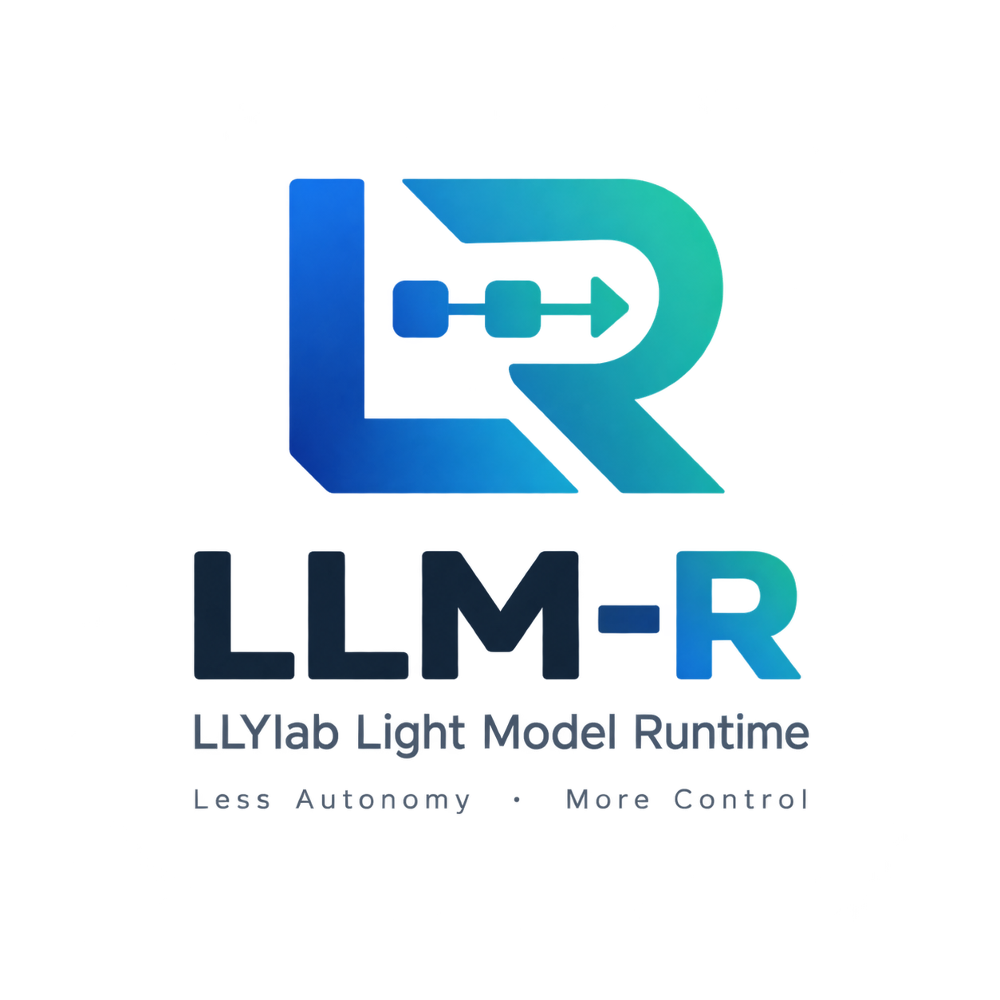
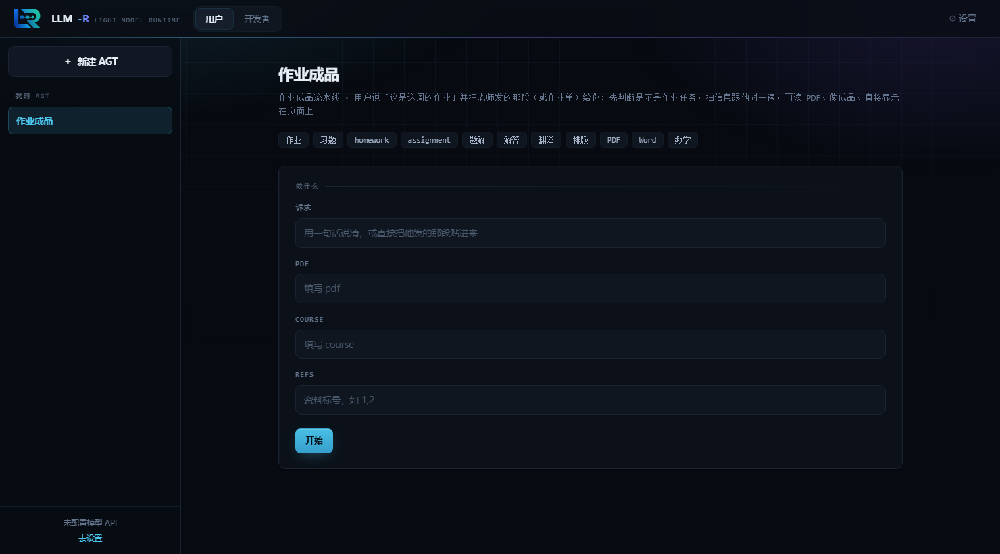
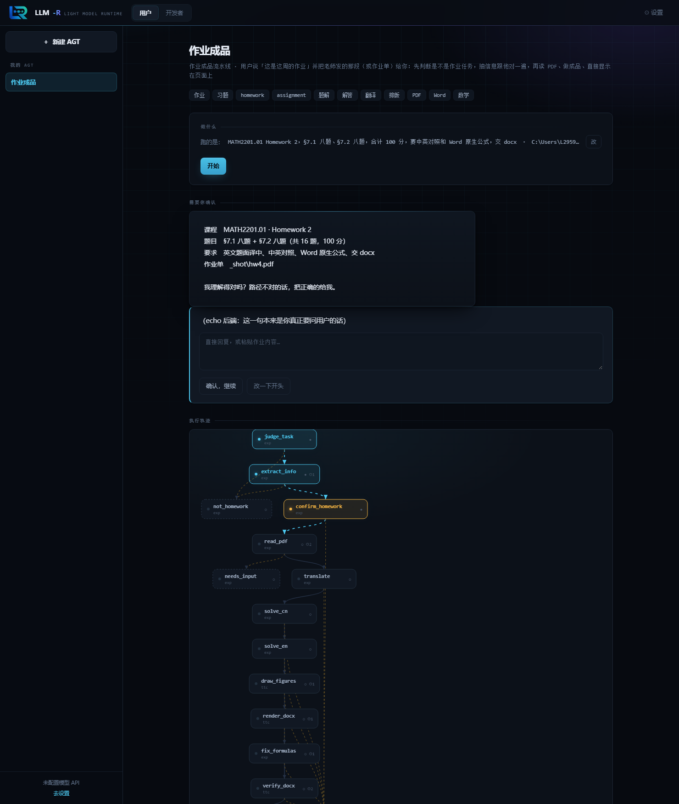
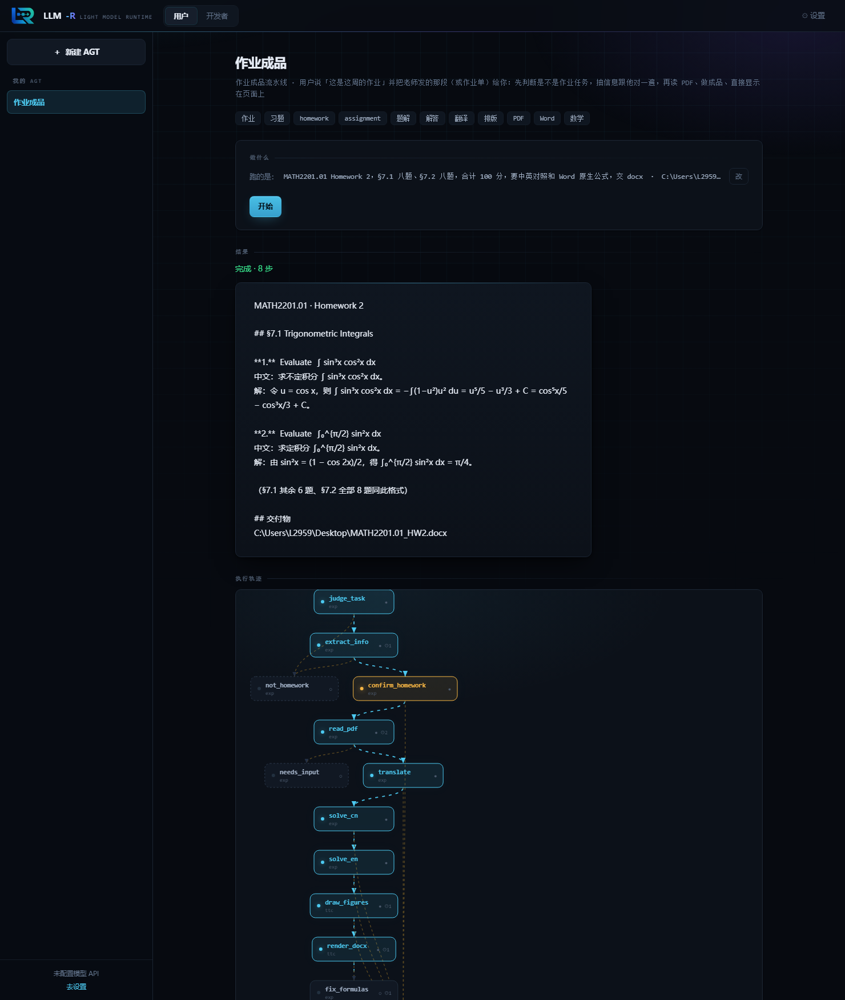
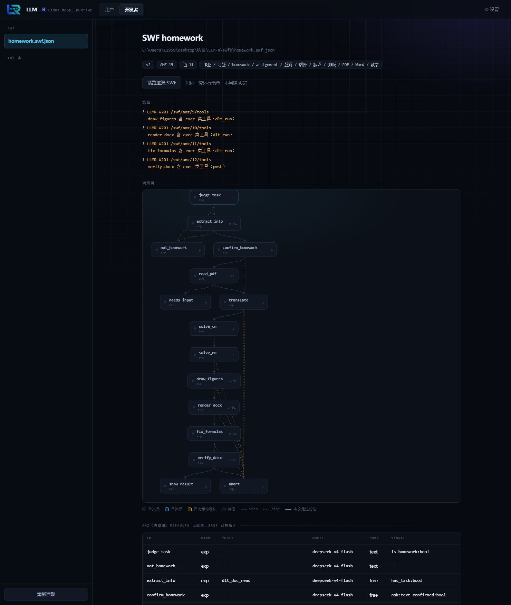

<div align="center">



### 别人在给 Agent 加自主性。LLM-R 在减。

**用「人工设计的固定工作流 + 硬编码调用的隔离容器」，取代「通用 Agent 的自主工具使用」。**

[](#证据不是形容词)
[](#30-秒跑起来)
[](#它长什么样)
[](LICENSE)



<sub>一个 AGT = 一个有名字的角色 + 它背后的固定工作流。用户只填「你要干什么」，剩下的交给流程。</sub>

</div>

---

## 问题不在模型，在你自己没定流程

你大概见过这种场面：给 Agent 一个任务，它开始自由发挥——调用一堆不相关的工具、把 8000 token 的工具表塞满上下文、跑到一半忘了目标、最后给你一个"大概是这样"的答案。你调了三个小时的 prompt，第二天换个说法又不行了。

**根本原因不是模型不够聪明，是你把"该怎么做"也交给了模型去现场决定。**

人类团队里没人这么干活。一份作业怎么做、一份合同怎么审、一次发布怎么走——这些是**流程**，是白纸黑字定下来的，不是每次临场发挥。只有流程定不下来的时候，我们才用"你看着办"。

LLM-R 把这个常识搬回 Agent：**流程由人写死，模型只负责执行它被分配的那一小块。**

| | 通用 Agent | LLM-R |
|---|---|---|
| 流程 | 模型临场推理 | **人写死的一张图** |
| 工具 | 全部塞进上下文 | **每个容器只见自己那几个** |
| 上下文 | 什么都往里塞 | **容器之间互不可见** |
| 能力 | 运行时才发现 | **设计期就是一张静态表，可审** |
| 出问题 | 不知道它为什么这么干 | **每一步都有结构化轨迹** |
| 界面 | 一个通用的臃肿 AI | **绑定工作种类** |

「避免干扰」在这里对**两个**对象成立：模型（推理质量）和用户（操作效率）。

---

## 它长什么样

LLM-R 里只有一个概念：**SWF（Stable WorkFlow）**——一张人工写死的工作流声明。它是纯数据。

```jsonc
// swfs/homework.swf.json（节选）
{
  "amz": [
    { "id": "judge_task",  "kind": "exp", "tools": [] },
    { "id": "extract_info","kind": "exp", "tools": ["dlt_doc_read"] },
    // 第 3 步：把抽到的信息摆出来问用户一句 —— 下面这行让它**停下来等人**
    { "id": "confirm_homework", "kind": "exp", "tools": [],
      "output": { "signal": { "fields": { "ask": "text" } } } },
    { "id": "read_pdf",    "kind": "exp", "tools": ["dlt_doc_read", "dlt_doc_convert"] }
  ],
  "order": [
    { "from": "judge_task", "to": "extract_info", "when": "signal.is_homework == true",
      "level": 2, "else": "not_homework" },
    { "from": "confirm_homework", "to": "read_pdf", "when": "run.status == 'ok'", "level": 1, "else": "abort" }
  ],
  "terminal": ["show_result", "not_homework", "abort"]
}
```

每个 **AMZ** 是一个**独立容器**：它有自己的系统提示词、自己那几个工具、自己的模型。容器之间默认互不可见。边上的 `when` 是由**确定性求值器**算的——不是模型说了算。

> **AMZ = 一个 DSH 对话。** LLM-R 不造运行时、不造权限引擎、不造记忆库——DSH 已经把这些做好了，LLM-R 只负责**按声明把它们编排起来**。

<div align="center">
<table><tr>
<td><br><sub>第 3 步：把「我理解成了什么」摆出来，等人点头——图上停在琥珀色那一格</sub></td>
<td><br><sub>第 7 步：成品直接显示在页面上，整条流走过的路亮着</sub></td>
</tr></table>
</div>

---

## 界面：把「流程」画出来

LLM-R 的界面只有两种人用，所以只有两种样子。

**普通用户**面对的是自己的 AGT：填「你要干什么」→ 开始 → 该确认的地方停下来问你 → 成品直接显示在页面上。

**作者**面对的是声明本身：校验结果、**调用图**、AMZ 有效值表、能力表面、审查凭据，改完可以直接**试跑**，不必先建一个 AGT。



调用图是**从声明真的画出来的**，不是示意图：

- 层号 = 从入口出发的最长路径；分支左右并排，环会被校验器提前拒掉
- 灰线是 `when` 边，**虚线**是 `else` 兜底边，虚框是终态
- 跑完之后，**走过的节点和边会依次点亮**（那是轨迹回放，数据来自真实执行，不是动画特效）
- 「在此等你确认」的节点是琥珀色——你一眼能看出流程卡在哪

> 暂停与恢复是**两次调用**，界面会把两段轨迹拼起来显示。
> 只显示后一段的话，图上前几步永远是黑的——那几步是真跑过的。

---

## 30 秒跑起来

**零运行时依赖**（只需要 Node，ajv 装上就多一层结构校验，不装也能跑）。

```bash
git clone https://github.com/LLYlab/LLM-R.git && cd LLM-R
node tools/llmr/homework.smoke.cjs     # 19 项：把一份真作业声明从头跑到尾，不花一分钱
node tools/llmr/selftest.cjs           # 39 项：加载器
node tools/llmr/server.cjs             # → http://127.0.0.1:8735/
```

WebUI 起来了就能点着走完整个流程——**默认 echo 后端，不产生任何模型花费**：

```
第一次运行：judge_task → extract_info → confirm_homework          ← 停在这，等人确认
恢复运行：  read_pdf → translate → solve_cn → solve_en → draw_figures
            → render_docx → verify_docx → show_result              ← 成品
```

要接真模型：**设置 → 模型 API** 填 Base URL 和 Key。注意这里配的只是**接口与凭据**——
**具体调哪个模型由 SWF 决定**，每张 SWF 的每个 AMZ 各自声明 `model`。
（Key 明文存在本地 `settings.json`，**永不回传浏览器**；共享机器上建议用环境变量。）

---

## 你凭什么信它

特写：**把一份老师发的作业，做成排版好看、公式可编辑的 Word，并显示在页面上。**

不是 demo 玩具，是**真的跑通的 7 步 / 11 个容器**（`swfs/homework.swf.json`）：

| 效果 | 声明里的节点 |
|---|---|
| 1 判断是作业任务 | `judge_task` |
| 2 从中提取信息 | `extract_info` |
| 3 **与用户确认作业** | `confirm_homework` → **暂停** |
| 4 自动读取作业 pdf | `read_pdf` |
| 5 开始转换 | `translate` → `solve_cn` → `solve_en` → `draw_figures` → `render_docx` |
| 6 搞好 | `verify_docx`（公式没成 OMML 就先绕 `fix_formulas` 修一次） |
| 7 显示作业于页面上 | `show_result` |

**每次运行都必然经过第 3 步的暂停**——这是设计，不是意外。
「暂停」用**已经存在**的 `output.signal` 通道表达（声明 `ask` 字段），**没有为它动 schema**。

两条不走主线的出口同样是硬编码的：不是作业 → `not_homework`；是作业但抽不出信息 → 也是 `not_homework`（**不硬凑**）。

---

## 证据，不是形容词

<table>
<tr><td width="50%" valign="top">

**240 项断言，全绿**

```
加载器          39
校验器          35   ← 含环检测
求值器/分析     51
执行器与后端    96   ← 含暂停/恢复
作业端到端      19   ← 真声明，非玩具图
────────────────────
合计           240
```

外加两个 fuzz 套件（**3.6 万份畸形输入，0 崩溃**）与一次一致性审计——
**23 个错误码 + 19 项检查的项数**，实现 ↔ 两份规格三方对齐。

</td><td width="50%" valign="top">

**22 处缺陷，几乎全部由「执行」抓出**

从 `tools` 被无条件 require 导致**每一个容器都过不了校验**，到 `onclick = runAgt` 把 **PointerEvent 当成参数**……

其中 4 处是纯静态分析根本不可能发现的——它们只在"真的点下去"的那一刻才现形。

最近一轮最有意思的一处：**给审计加了「项数必须一致」这条之后，它第一次运行就抓出 11 处漂移**——
文档里同时写着 15 项、16 项、17 项。没人改错，只是**没有任何东西在管这个数字**。

</td></tr>
</table>

这个项目有一条自己的原则，写在规格里：

> **规格的缺陷只能靠执行暴露。** 所以先把校验器和执行器做出来，比继续写文档划算得多。

**而且这条原则适用于文档本身**：既然人会漂，就给文档装一条会失败的检查。
`auditcodes.cjs` 就是这么来的——它现在是这个仓库里唯一"读文档"的东西，而它是个程序。

---

## 说清楚门槛（这条必须明说）

**LLM-R 不是"装上就什么都能干"的通用 AI。** 它面向**中型/大型、任务性质明确、流程可复用**的工作。

**作者门槛很高。** 不会写 SWF 的用户只剩三条路：

1. **拷大佬的**——SWF 可以导入导出、可以分享
2. **提 issue 求作者**——但**作者是瓶颈**
3. 用兜底的临时工作流

> **LLM-R 是给"有能力定义自己工作流的人"的工具。**
>
> 这是明确的设计取舍，不是待修的缺陷。想让 AI 替你决定一切的人，不该用 LLM-R——市场上那样的产品已经很多了。

---

## 文档地图

| 我想… | 看 |
|---|---|
| 搞懂 LLM-R 是什么、为什么这么设计 | **[`LLMR-设计规格.md`](LLMR-设计规格.md)** ← 唯一权威规格 |
| 看结构约束（机器可读） | [`llmr.schema.json`](llmr.schema.json) ← v1.0，已冻结 |
| 看声明语法与 17 项校验细则 | [`LLMR-声明格式规格-02.md`](LLMR-声明格式规格-02.md) |
| 看 19 项检查的算法与错误码目录 | [`LLMR-校验器规格.md`](LLMR-校验器规格.md) |
| 抄一个能干活的真货 | [`swfs/homework.swf.json`](swfs/homework.swf.json) |
| 看实测证据、缺陷清单、当前状态 | [`docs/开发记录.md`](docs/开发记录.md) |
| 看被取代的旧设计（过程记录） | [`docs/history/`](docs/history/) |

---

## 它**不做**什么

一个项目愿意不做什么，比它宣称能做什么更能说明它是谁。

> **LLM-R 只做「把 SWF 跑起来」这一件事，其余全用现成的。**

编辑界面、权限引擎、记忆库、**嵌套**、训练平台、性能框架、专家路由——
**不在 LLM-R 的范围里，LLM-R 也不逐项权衡它们。**
在那些方向上，LLM-R 借用宿主已有的东西：会话、工具与插件、模型路由、界面槽位、大块内容存储。

而「不做嵌套」这一条有个**副作用**，值得单独写出来，因为它是个陷阱：

> 嵌套会**击穿** LLM-R 的审查机制——子 SWF 里的工具绑不进父的能力表面，而审查哈希只覆盖父。
> **改子 SWF 不改哈希 → 审查被绕过。**
>
> LLM-R 的答案是**不做嵌套**。任何要做嵌套的系统，都必须让
> **能力表面递归展开、哈希覆盖整棵子树**——否则"可审查"这个承诺在嵌套出现的第一天就失效了。

这条不是理论推演：它是 LLM-R 在设计能力表面时**被自己的机制逼出来的结论**。

---

## 九条设计原则

1. **固定优先**——SWF 固定、AMZ 固定、工具/权限静态绑定、UI 固定。唯一的"流动"是判定之前。
2. **隔离优先**——容器之间互不可见；隔离由"独立会话"结构性提供，不需额外机制。
3. **硬编码优先于自主**——能用确定性规则就别用模型；能用固定边就别用 tool use。
4. **避免干扰，对模型与用户同样成立。**
5. **可审查性**——能力是设计期的一张静态表，所以陌生 SWF 能被审。**前提是这张表完整。**
6. **所有可复用实现全局注册，SWF/AMZ 只声明选用。**
7. **能力盒子里得真装东西**——没有专用工具的 AMZ 只有省钱，没有能力增益。
8. **规格的缺陷只能靠执行暴露。**
9. **边界纪律**——❌ 项是**承诺**，不是"暂时没做"。每加一项都合理，加起来就不是轻量了。

---

<div align="center">

### English

**LLM-R turns agent workflows into data you can read, review, and version — instead of letting the model improvise.**

Every other agent framework is adding autonomy. LLM-R removes it: a human writes a fixed workflow (an **SWF**), the model only executes the narrow slice it is assigned inside an isolated container (**AMZ**). No dynamic tool selection, no tool table in context, no cross-container leakage.

Zero runtime dependencies. 240 passing assertions. Schema frozen at v1.0. The whole runtime — validator, loader, executor, WebUI — is ~3,900 lines of plain JavaScript.

Start here: **[`LLMR-设计规格.md`](LLMR-设计规格.md)** — the single authoritative spec (Chinese).

</div>

---

<div align="center"><sub>MIT © 2026 LLYlab · LLM-R 不依赖 DSH，前后端都能独立运行</sub></div>
